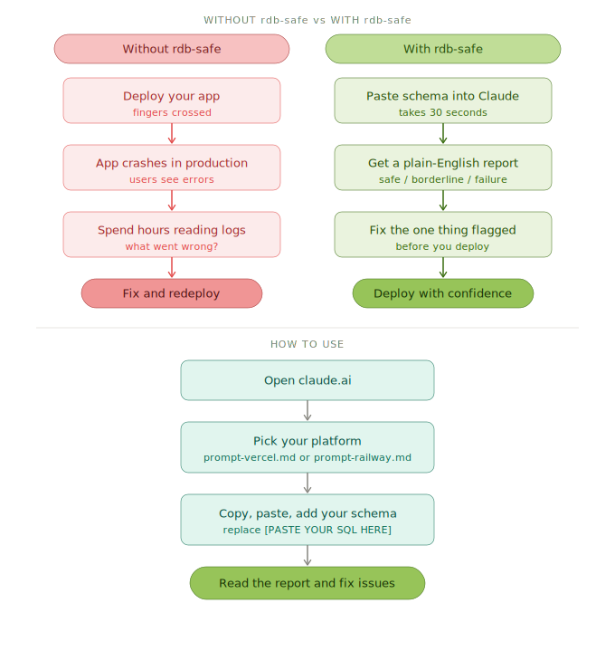

# rdb-safety-checker

**Avoid database crashes when launching your app on Vercel or Railway.**

Paste your database code into Claude and get a plain-English report on what will break — before you go live.

## Two real scenarios

**Scenario 1 — The silent crash**

Hana launches her booking app on Vercel. Everything works fine in testing. On launch day, 60 people visit at the same time and the app goes down. The error log says "too many connections." She had 20 database connections available but needed 60. rdb-safe would have caught this in 30 seconds and told her to add a connection pooler before launch.

**Scenario 2 — The failed deploy**

Kenji pushes his e-commerce app to Railway. The deploy starts, runs for 70 seconds, then fails with a timeout error. His database setup was too complex to finish within Railway's limit. He has no idea why. rdb-safe would have flagged his large product table and told him to split the setup into two steps.

## Which file do I use?

| I am deploying on... | Use this file |
|----------------------|---------------|
| Vercel | `prompt-vercel.md` |
| Railway | `prompt-railway.md` |

## What does it check?

| Problem | What goes wrong without this check |
|---------|-----------------------------------|
| Too many users at once | Your app stops accepting requests |
| Missing settings | App crashes silently on launch |
| Database setup takes too long | Deploy fails halfway through |

## Based on

Ishii & Jahangir — *"A Simple Mathematical Boundary for Safe Relational Database Deployment in Serverless Environments"*
